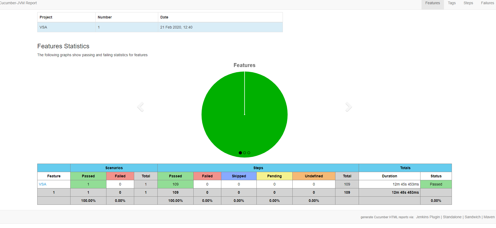

**How to setup:**
1. Download and install JAVA 8 at here https://www.java.com/en/download/win10.jsp
2. Install GIT
    https://git-scm.com/
3. Open any folder and clone source to local as following command

    git clone https://gitlab.com/toannguyenms/ms_auto.git

4. Set up JAVA_HOME and MAVEN_HOME
    https://mkyong.com/maven/how-to-install-maven-in-windows/
5. Build source 

    mvn clean

**How to run:**
1. Open the source folder
2. Open Command Line or Window Power Sell
3. Run following command:

    2. Pull latest source before running
    
    git pull

    3. For server is using iink server
    
    mvn clean test -DsuiteName=DTWPRunner -Dserver=env -Dusername=xxx -Dpassword=xxx
    
    4. For server is using dpink
    
    mvn clean test -DsuiteName=DevEnvRunnerTest -Dserver=env -Dusername=xxx -Dpassword=xxx
    
    E.g.: Env: https://d3levvia.aaps.deloitte.com/
    
**How to view the cucumber report**

Open report in folder: Report/cucumber-html-reports/feature-overview.html

